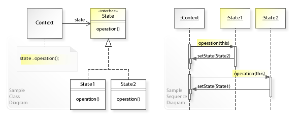

# State Pattern (상태 패턴)

 

- 상태패턴의 UML 클래스 및 시퀀스 다이어그램

이미지 출처) https://ko.wikipedia.org/wiki/%EC%83%81%ED%83%9C_%ED%8C%A8%ED%84%B4

- 스테이트 패턴은 객체가 특정 상태에 따라 행위를 달리해야하는 상황에서,
자신이 직접 상태를 체크하여 상태에 따라 행위를 호출하지 않고 상태를 객체화 하여 상태가 행동을 할 수 있도록 위임하는 패턴을 말한다.

- 객체의 특정 상태를 클래스로 선언하고, 클래스에서는 해당 상태를 할 수 있는 행위들을 메서드로 정의한다.
그리고 이러한 각 상태 클래스들을 인터페이스로 캡슐화 하여, 클라이언트에서 인터페이스를 호출하는 방식을 말한다.

- 상태 패턴을 구현한다는 것은 각 상태에 대응하는 별도의 클래스를 만들고 상태 전이 로직을 그 클래스들로 옮기는 작업을 뜻한다.

- 전략패턴과 상당히 유사하나, 전략 패턴은 상속을 대체하려는 목적 / 스테이트 패턴은 코드내의 조건문을 대체하려는 목적으로 사용된다.

- 상태 전이를 위한 조건 로직이 지나치게 복잡한 경우 이를 해소하려는 목적으로 사용한다.

- 스테이트 패턴 구현 시..
    - 하나의 상태를 클래스 하나로 명확하게 표현하는 것과, 상태 변수의 값으로 표현하는 것 사이에서 저울질해봐야 한다.
        - 상태 패턴으로 리팩토링한 결과가 더 복잡하다면, 굳이 스테이트 패턴을 도입하지 말자
    
    - 스테이트 패턴은 if/else/switch 등 조건문을 효과적으로 제거 가능

    - 클래스의 수가 취급해야 하는 상태의 수 만큼 추가로 늘어난다는 점에 주의하자. 이것은 상황에따라 장점일 수도 있다.

    - 각 상태가 자신의 다음 상태를 알아야 한다는 특징이 있다.

내용 참고) https://johngrib.github.io/wiki/pattern/state/#fn:joshua-235