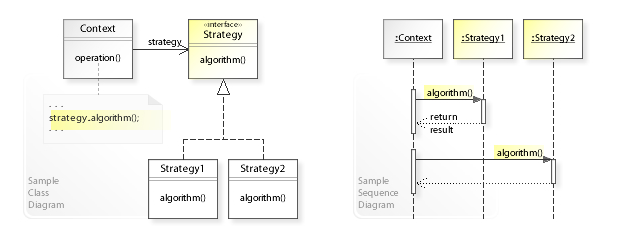

# Strategy Pattern (전략 패턴)

 

- 전략패턴의 UML 클래스 및 시퀀스 다이어그램

이미지 출처 : https://ko.wikipedia.org/wiki/%EC%A0%84%EB%9E%B5_%ED%8C%A8%ED%84%B4

- 같은 기능이지만 서로 다른 전략을 가진 클래스들을 각각 캡슐화하여 상호교환 할 수 있도록
    하는 패턴

- 인터페이스의 다형성 활용

- 객체가 할 수 있는 기능을 각각 전략으로 만들어놓고, 기능 수정이 필요한 경우 전략을 변경하는 것만으로 기능의 수정이 가능하도록 하는 패턴
