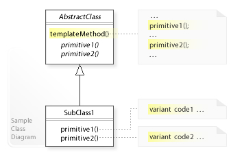

# Template Method Pattern (템플릿 메서드 패턴)

 

- 템플릿 메서드 패턴의 UML 클래스 다이어그램

- 

이미지 출처) https://ko.wikipedia.org/wiki/%ED%85%9C%ED%94%8C%EB%A6%BF_%EB%A9%94%EC%86%8C%EB%93%9C_%ED%8C%A8%ED%84%B4

- 여러 프로그램이 비슷한 구조로 돌아갈 때, 기본 템플릿에 해당하는 로직은 일괄적으로 관리하면서
    각 프로그램마다 달라지는 부분들에 대해서는 따로 만들고 싶은 경우 해당 패턴을 사용한다.

- 객체지향 개발에서 자주 사용하는 패턴

- 상속을 통해 슈퍼클래스의 기능을 확장할 때 사용하는 가장 대표적인 방법. 
변하지 않는 기능은 슈퍼클래스에 만들어두고 자주 변경되며 확장할 기능은 서브클래스에서 만들도록 한다.
