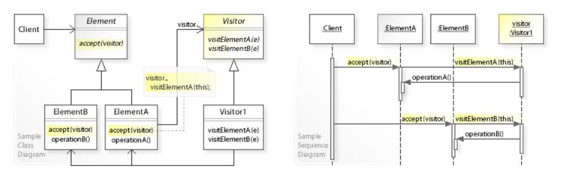

# Visitor Pattern (방문자 패턴)

 

- 방문자 패턴의 UML 클래스 및 시퀀스 다이어그램

  

이미지 출처) https://ko.wikipedia.org/wiki/%EB%B9%84%EC%A7%80%ED%84%B0_%ED%8C%A8%ED%84%B4

- 실제 로직을 가지고 있는 객체(Visitor)가 로직을 적용할 객체(Element)를 방문하면서 실행하는 패턴이다.
  - 즉, 로직과 구조를 분리하는 패턴
  - 구조를 수정하지 않고도 새로운 동작을 기존 객체 구조에 추가할 수 있다.

- 데이터 구조 안을 돌아다니는 주체인 방문자를 나타내는 클래스를 준비해서 수행 로직의 처리를 맡긴다.

- 새로운 처리를 추가하고 싶을 땐 새로운 방문자를 만들고 데이터 구조는 방문자를 받아들이면 된다.

- 방문자 패턴은 개방-폐쇄 원칙을 적용하는 방법 중 한 가지이다.
    - 확장에 대해 열려있고, 수정에 대해 닫혀있다.

- 비지터 패턴을 언제 사용할지?
  - 적용해야 할 대상 객체가 잘 바뀌지 않고, 적용할 알고리즘이 추가될 가능성이 많은 상황인 경우 사용을 고려해봐야 한다.
  - 대상 객체가 가지는 동작과 객체를 분리하여 코드의 응집도를 높이고자 할 때 사용할 수 있다.

- 장점
  - 작업 대상(Element)과 작업 항목(Visitor)을 분리 시킨다.
    - 데이터와 알고리즘이 분리되어, 데이터의 독립성을 높여준다.
  - Element의 입장에서는 visitor를 전달받아 작업을 수행할 하나의 메서드로 인터페이스를 통일시켜,
    사용자에게 동일한 인터페이스를 제공 가능하다.

- 단점 
  - 구조가 복잡하다. (Double Dispatch 에 대한 이해가 필요) 
  - 새로운 작업 대상(Element)이 생길때 마다, 작업 주체(Visitor) 쪽도 이에 대한 로직이 추가되어야 한다.
  - Element 와 Visitor의 결합도가 높아짐 - 서로의 메서드 호출