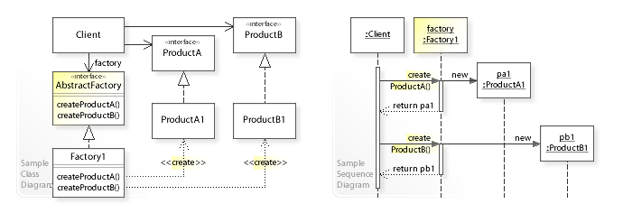

# Abstract Factory (추상 팩토리) 패턴

- 추상 팩토리 패턴의 UML 클래스 및 시퀀스 다이어그램

이미지 출처) https://ko.wikipedia.org/wiki/%EC%B6%94%EC%83%81_%ED%8C%A9%ED%86%A0%EB%A6%AC_%ED%8C%A8%ED%84%B4

- 팩토리메서드 패턴과 비슷하나 추상 팩토리 패턴에서는 
팩토리 클래스에서 서브 클래스를 생성하는 데 if-else 문을 사용하지 않는다.

- 추상 팩토리 패턴은 인풋으로 서브클래스에 대한 식별 데이터를 받는 것이 아니라 
또 하나의 팩토리 클래스를 받음

- 팩토리 메서드 패턴을 좀 더 캡슐화한 방식이라고 볼 수 있다.

 

### 장점

- 추상 팩토리 패턴은 구현(Implements)보다 인터페이스(Interface)를 위한 코드 접근법을 제공

- 추상 팩토리 패턴은 추후에 sub class를 확장하는 것이 쉬움

- 추상 팩토리 패턴은 팩토리 패턴(팩토리 메소드 패턴)의 조건문(if-else, switch 등)으로부터 벗어날 수 있다.

- 객체 생성 과정에서의 일관성이 높아진다.

### 단점

- 수정이 불편하다.
    - 새로운 제품 클래스를 추가하게 된다면, 기존 추상 팩토리를 확장하기가 쉽지 않다. 
        - 추상 팩토리를 상속하고 있는 모든 팩토리에도 새로운 제품에 대한 구현 방법이 수정되어야 하기 때문
     