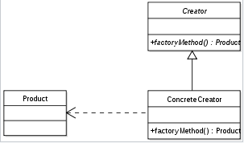

# Factory Method - 팩토리 메서드 패턴

- 팩토리 메서드 패턴의 UML 다이어그램

이미지 출처) https://ko.wikipedia.org/wiki/%ED%8C%A9%ED%86%A0%EB%A6%AC_%EB%A9%94%EC%84%9C%EB%93%9C_%ED%8C%A8%ED%84%B4

- 객체를 생성하기 위해 인터페이스를 정의하지만, 어떤 클래스의 인스턴스를 생성할지에 대한 결정은 서브클래스가 내리도록 하는 패턴
    - 팩토리 메소드란 쉽게 말하면 객체를 생성 반환하는 메서드이다.

- 다시 말해서 팩토리메서드 패턴이란 여러 개의 서브 클래스를 가진 슈퍼 클래스가 있을 때 
인풋에 따라 하나의 자식 클래스의 인스턴스를 리턴해주는 방식이다.

- 클래스의 인스턴스를 만드는 시점을 서브 클래스로 미룸

 

### 주로 사용하는 상황

- 어떤 클래스가 자신이 생성해야 하는 객체의 클래스를 예측할 수 없는 상황
- 생성할 객체의 구현을 자신의 서브클래스가 해야할 때

 

### 장점

- 팩토리 패턴은 클라이언트 코드로부터 서브 클래스의 인스턴스화를 제거하여 서로 간의 종속성을 낮추고, 
결합도를 느슨하게 하며(Loosely Coupled), 확장을 쉽게 한다.

- 클라이언트와 구현 객체들 사이에 추상화를 제공

 

### 단점

- 클래스가 많아진다. (클래스 계층도 커질 수 있다.)
  - 제품 클래스가 바뀔 때마다 새로운 서브클래스를 생성해야 한다.
- 클라이언트가 creator 클래스를 반드시 상속해 Product를 생성해야 한다.