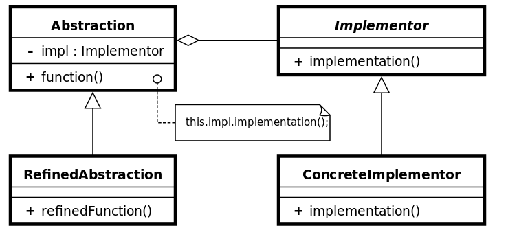

# Bridge Pattern - 브릿지 패턴

- 브리지 패턴 다이어그램

이미지 출처) https://ko.wikipedia.org/wiki/%EB%B8%8C%EB%A6%AC%EC%A7%80_%ED%8C%A8%ED%84%B4

- 객체의 확장성을 향상하기 위한 패턴, 객체에서 동작을 처리하는 구현부와 확장을 위한 추상부를 분리한다.

- 브리지 패턴은 기능을 처리하는 클래스와 구현을 담당하는 추상 클래스로 구별한다.
    구현뿐 아니라 추상화도 독립적 변경이 필요할 때 브리지 패턴을 사용한다.

- 2개의 객체는 추상화를 구현에서 분리하여 매우 독립적으로 사용할 수 있어야 한다.

- 브리지 패턴은 기존 시스템에 부수적인 새로운 기능들을 지속적으로 추가할 때 사용하면 유용하다.

- 브리지 패턴은 새로운 인터페이스를 정의하여 기존 프로그램의 변경 없이 기능을 확장할 수 있다.

- 브리지 패턴은 언제 사용하면 좋은가?
    - 부모 추상 클래스가 기본 규칙 세트를 정의하고 구체적인 클래스가 추가 규칙을 추가하고 싶은 경우
    - 객체에 대한 참조가 있는 추상 클래스가 있고 각 구체적인 클래스에서 정의될 추상 메서드가 있는 경우

- 추상화와 구현이 독립적으로 다른 계층 구조를 가질 수 있고, 클라이언트 애플리케이션으로부터 구현을 숨기고 싶을 때 사용될 수 있음.