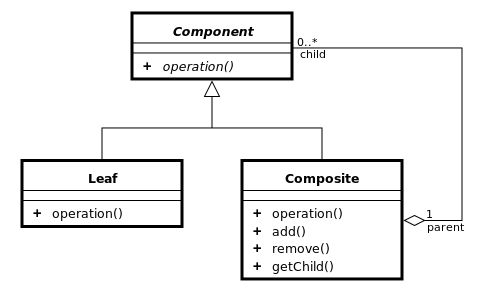

# Composite Pattern - 컴포지트 패턴 (복합체 패턴)

- 컴포지트 패턴의 UML 다이어그램

- 이미지 출처) https://ko.wikipedia.org/wiki/%EC%BB%B4%ED%8F%AC%EC%A7%80%ED%8A%B8_%ED%8C%A8%ED%84%B4

- 전체의 계층을 하나의 인터페이스로 통합해서 트리구조로 구성하는 구조 패턴중 하나이다.

- 개별객체와 그 개별객체를 포함하는 복합객체를 모두 동일하게 다룬다.

- 컴포지트 패턴의 가장 중요한 요소는 개별객체와 복합객체 모두를 표현할 수 있는 하나의 추상화 클래스를 정의하는 것

- 컴포지트 패턴은 파일 - 폴더와 같이 전체의 객체 계통을 표현하고 싶을 때 사용하면 된다.

- 장점 : 사용자 입장에서는 이게 단일 객체인지 복합 객체인지 신경쓰지 않고 사용할 수 있다.

- 단점 : 설계가 지나치게 범용성을 갖기 때문에 새로운 요소를 추가할 때 복합 객체에서 구성요소에 제약을 갖기 힘들다.
    - 수평적, 수직적 모두 방향으로 객체를 확장 가능하나, 수평적 방향으로만 확장하도록 Leaf를 제한한 Composite를 만들기는 어렵다.
  

- 내용 참고) https://sup2is.github.io/2020/06/25/composite-pattern.html