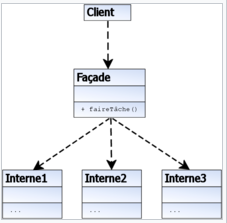

# Facade Pattern - 퍼사드 패턴

- 퍼사드패턴의 UML 다이어그램

- 이미지 출처) https://ko.wikipedia.org/wiki/%ED%8D%BC%EC%82%AC%EB%93%9C_%ED%8C%A8%ED%84%B4

- 퍼사드 패턴은 서브시스템에 있는 인터페이스들에 대한 통합된 인터페이스를 제공하는 패턴이다.

- 퍼사드란 서브시스템을 더 쉽게 사용할 수 있도록 만드는 더 높은 수준의 인터페이스를 말한다.

- 사용자가 복잡한 작업을 수행(복잡한 서브 클래스들의 집합)해야 할 때, 간단한 방법을 제공(단순화된 인터페이스를 생성)해준다.

- 이와 같은 상황에서 사용
  - 서브 시스템을 계층화 하고 싶을 때
  - 복잡한 서브 시스템을 간단하게 사용하기위한 인터페이스를 생성하는 경우

- 장점
  - 서브 시스템의 복잡성으로부터 코드를 분리가능
  - 클라이언트가 서브 시스템을 사용하기 쉽게 만들어 준다.
  - 시스템과 객체간 종속성을 계층화 할 수 있다.