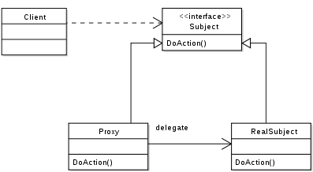

# Proxy Pattern - 프록시 패턴

- 프록시 패턴의 UML 다이어그램

- 이미지 출처) https://ko.wikipedia.org/wiki/%ED%94%84%EB%A1%9D%EC%8B%9C_%ED%8C%A8%ED%84%B4

- 클라이언트가 요청 시 Proxy(대리자) 객체가 실제 기능을 수행하는 객체 대신 먼저 호출되고,
그 프록시 객체가 실제 기능을 수행하는 클래스를 호출하여 반환 값을 받는다.

- 구현 클래스에 직접 접근하지 않고 Proxy를 통해 우회하여 접근한다.

- 원래 하려던 기능을 수행하며 그 외의 부가적인 작업을 수행하기 적합하다.
  - 로깅, 인증, 네트워크 통신, 흐름제어 등

- 사용자 입장에서는 프록시 객체나 실제 객체나 사용법은 비슷하므로 사용성이 좋다.